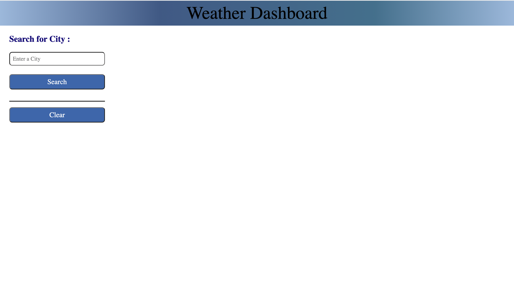
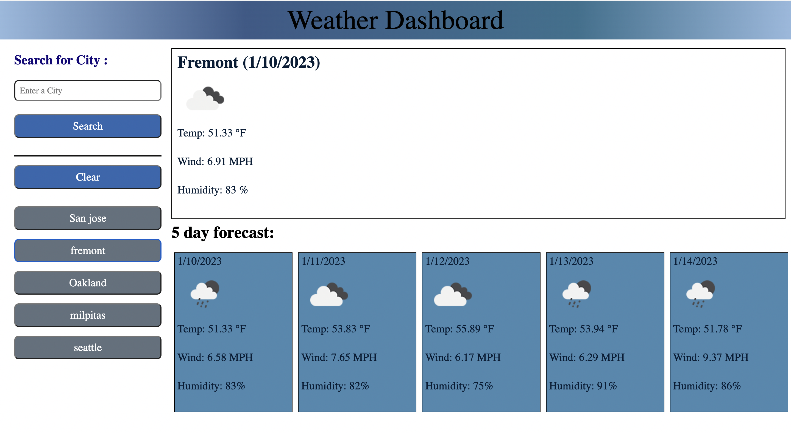
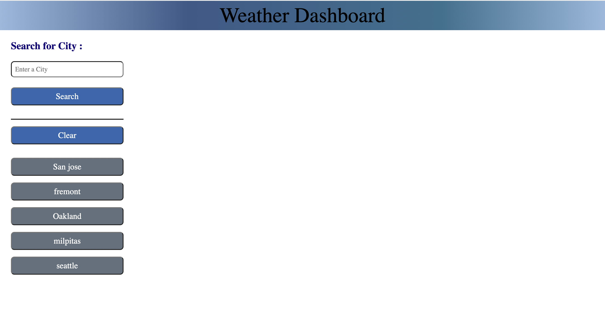

# weather-dashboard

## Technology Used 

| Technology Used         | Resource URL           | 
| ------------- |:-------------:| 
| HTML    | [https://developer.mozilla.org/en-US/docs/Web/HTML](https://developer.mozilla.org/en-US/docs/Web/HTML) | 
| CSS     | [https://developer.mozilla.org/en-US/docs/Web/CSS](https://developer.mozilla.org/en-US/docs/Web/CSS)      |   
| JavaScript | [https://developer.mozilla.org/en-US/docs/Web/JavaScript](https://developer.mozilla.org/en-US/docs/Web/JavaScript) |
| jquery | [https://api.jquery.com/](https://api.jquery.com/)     |   
| openWeatherAPI | [https://openweathermap.org/api](https://openweathermap.org/api)     |   
| Git | [https://git-scm.com/](https://git-scm.com/)     |   

 

## Description 

This application displays the weather data for any city that the user wants to view using openWeatherAPI.
The user can search for any city to view the current weather and 5 day forecast. This application is built using HTML, CSS, jQuery, Serverside API call request/repsonse handling.

The current weather & 5 day forecast section is includes the following weather conditions and current date.

City, Date, Icon-image, Temperature, Humidity & Wind Speed

The local storage is used  to store the previously searched city and display them to the user in the left side of the page under the list group. The user can also clear the search history by clicking the clear  button. If the user wants to see the past search city weather condition again, he can click on the city name on list item cities under the clear  button.

 

## Usage 

Welcome Page where users can see weather info for any city.

 

 

When the user enters the city Name and click "Search" button, weather forecast appears as shown here and searched city gets stored in local storage.

 

 

The user can click on any previously searched city to see the weather data.

 

 

## Learning Points 

* create server side web application using web api
* fetch/ajax request/response handling

 

## Links

Github Repo - https://github.com/srinithi19/weather-dashboard  
Application URL - https://srinithi19.github.io/weather-dashboard/
